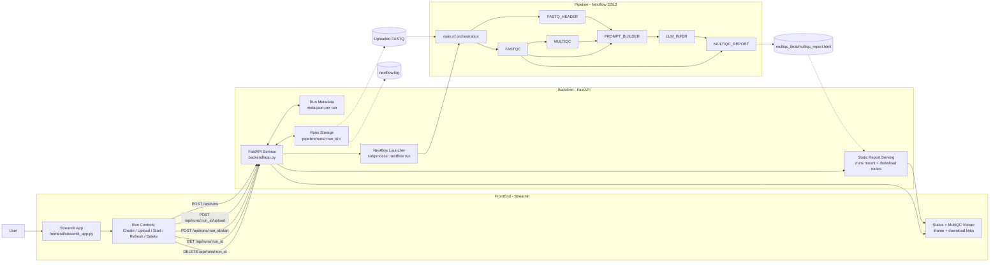

# System Architecture

This document captures the current proof-of-concept architecture across the first-party FrontEnd, BackEnd, and Pipeline layers. It shows how user actions in Streamlit trigger FastAPI run lifecycle APIs, launch the Nextflow workflow, and return a generated MultiQC report for viewing and download.

## Scope

FrontEnd + BackEnd + Pipeline only (first-party scope). External infrastructure and third-party services are intentionally abstracted out.

## Combined Architecture Diagram

Legend:
- Solid arrow: API/control execution
- Dashed arrow: file/data artifact movement

## Runtime Path

1. Create run
2. Upload FASTQ
3. Start Nextflow
4. Poll status/log
5. Produce final MultiQC report with LLM-enriched comment
6. View/download report

## Notes

This is a local PoC architecture with filesystem-based orchestration. Run state and artifacts are persisted under per-run directories, the backend launches Nextflow as a subprocess, and frontend report access is served through backend-managed API and static routes.
